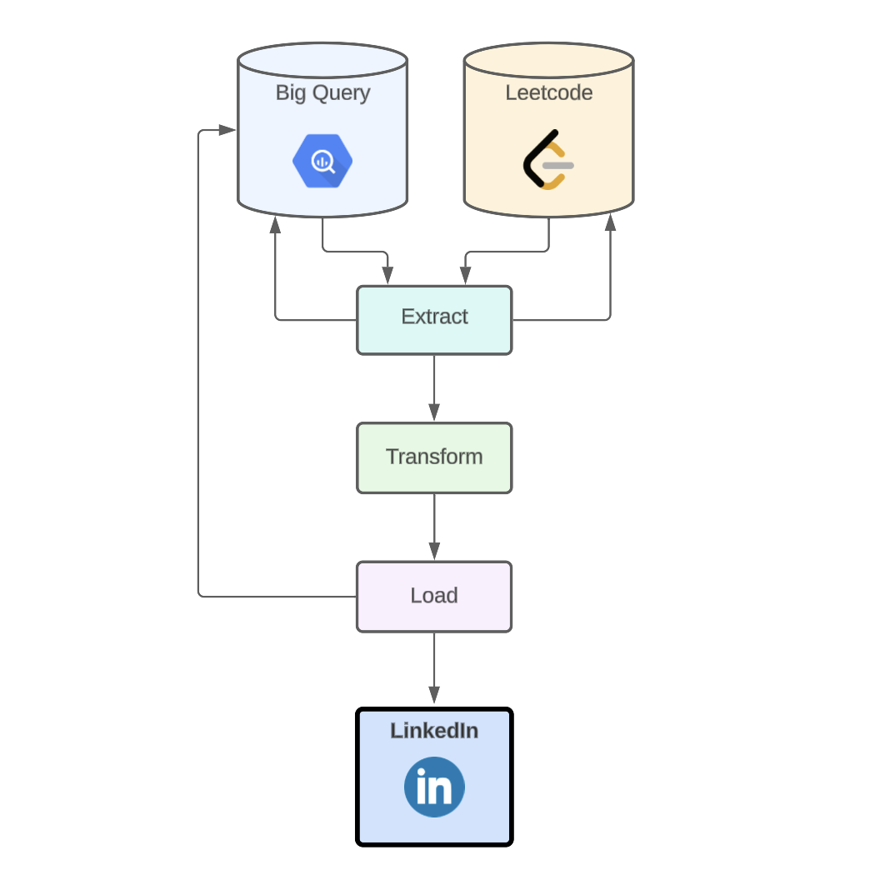

# Automated LinkedIn Posts + Leetcode

## Project Description
The motivation for this project is that I want to remain active on LinkedIn while also remaining consistent with practicing Leetcode; however, doing both of these activities everyday after work was too time consuming, and I wanted to use automation to add more hours back into my free time, while not compromising on my goals.

My solution was to utilize the Leetcode and LinkedIn API's along with Big Query, to create an ETL pipeline that every two hours extracts my solved problems from Leetcode, checks if there are any new problems (not existing yet in my database), generates a post based on the new problems, and automatically posts to LinkedIn using the LinkedIn API. 


One of my favorite parts about this project is how I get to interact with other data people around the world.

Here are some of the messages I received related to the posts I make:

> "Hey Paul how's it going brotha. I just wanted to say I'm hella inspired by you and some of the things you've done to learn."

> "Dear Paul, I hope this message finds you well. I impressed by your active coding practice. I wanted to take a moment to appreciate your dedication and efforts in honing your coding skills. It's inspiring to see your commitment to continuous learning and improvement in the field of coding." 

## How it Works

The way that this pipeline works is relatively simple and follows these steps:
1. Extract data from Big Query database and Leetcode API.
2. Compare all problems in database to all solved problems from Leetcode.
3. If there is 2 or more new solved problems in the response from leetcode, continue, otherwise do nothing.
4. Given there are 2 or more new solved problems, transform the responses from Leetcode into a LinkedIn post.
5. Post/Load the LinkedIn post onto LinkedIn profile using API.
6. Update the bigquery database.

This pipeline runs every two hours using GitHub actions. 



## Maintenance: Variables which will expire or change overtime in this project.

A few important notes about these variables: 

1. These variables will all need to be updated at some point (every few months). 
2. The pipeline will break when these tokens expire. 
3. The tokens cannot be seen again after they are saved as github secrets.  

### Leet Code Variables
Helpful resources:

https://medium.com/@samarthgvasist/python-leetcode-api-1379e29c2fbc

How to get the Leetcode CSRF and session tokens.
1. Navigate to https://leetcode.com/
2. Right click anywhere on the website, and click inspect.
3. Navigate to “Application” in the inspect window. 
4. Navigate to the “Filter” search bar, and type in “csrf”.
5. Copy the value.

### LinkedIn Variables

Helpful resources:

https://learn.microsoft.com/en-us/linkedin/shared/integrations/people/profile-api

https://www.youtube.com/watch?v=jYflkIo1R4A

https://www.youtube.com/watch?v=yY6yP3oUc8c

https://www.youtube.com/watch?v=klGhFx0CTSo

I used all of these videos to help get my LinkedIn company account activated (to get access to API), as well as how to get tokens, and which permissions are required. This was a relatively tedious task but once it is complete, you will not have to redo everything.

The tokens expire every 2 months; however, you will *not* need to re create a company account every two months.

In order to get this token, I am assuming that your LinkedIn company account is already authorized, your LinkedIn app is created, as well as your credentials are all verified. If not, follow the videos above, because it is a non trivial process to get everything set up properly; however, once it is, hopefully the only maintenance will be swapping out the tokens when they expire.

#### LINKED_IN_OATH_2_TOKEN:

Given that the account is set up,

1. Navigate to https://developer.linkedin.com/ 
2. Click on “my apps”/ Login
3. Navigate to your app. Select “Auth” next to settings.
4. Navigate to OAuth 2.0 tools on the right panel. 
5. Select Create new token, copy and save it. 

#### LINKED_IN_USER_URN

In order to access the URN, you must first create the user OATH code in the previous step, otherwise you will not be able to access the user URN via the API. 

1. Navigate to this URL, and replace “YOUR_TOKEN” with your token from the previous steps. 
    
    ```
    https://api.linkedin.com/v2/me?oauth2_access_token=YOUR_TOKEN
    ```
    
2. That will output a JSON in the browser, find the “ID” value and copy it.

## Whats next?
There are many things that could be added to this pipeline, for example, using Chat GPT API to automatically generate engaging posts. 

## Do it Yourself! 
If you would like to automate your LinkedIn with the Leetcode API, follow the articles and videos I posted above, to create LinkedIn company account, and gain access to the required tokens. Then clone this repo, create a virtual environment, pip install the requirements.txt file, add the required tokens, and let the pipeline run! 

### If you find this repo helpful for your project leave a star! ⭐

### If you have any questions open a issue!


